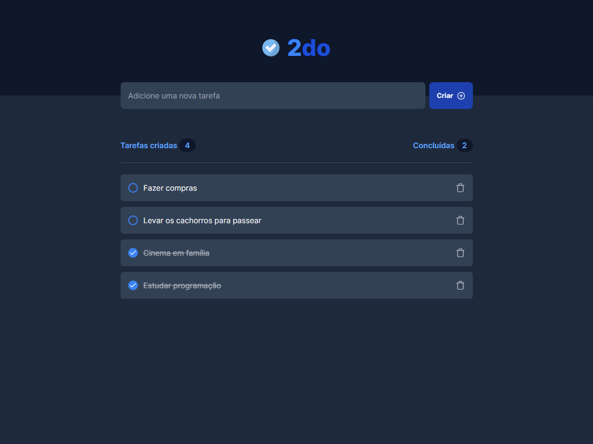
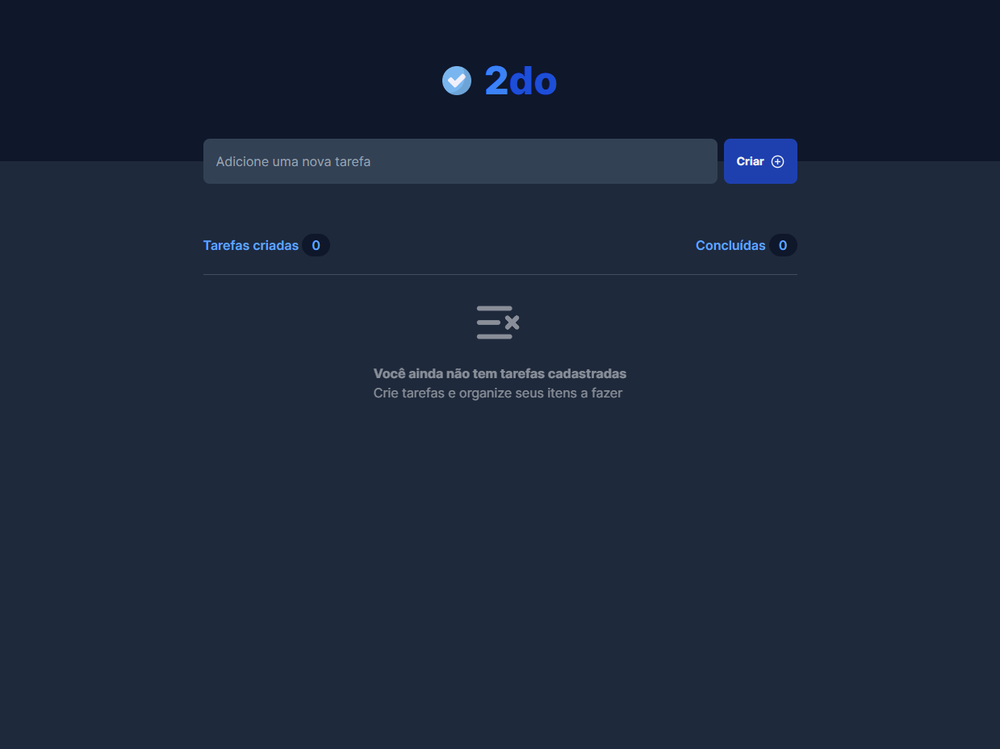

# 2do List

## Control and organize your daily tasks

> The project aimed to improve knowledge about states, principle of immutability, properties, hooks and array manipulation, using React+Vite, Tailwind CSS and TypeScript to build it.

🔗 [Click here to access](https://matheusborgesdev.github.io/2-do-list/)

## 💻 Technologies

- React+Vite
- Tailwind CSS
- TypeScript

## 📧 Contact

matheusb.dev@gmail.com
